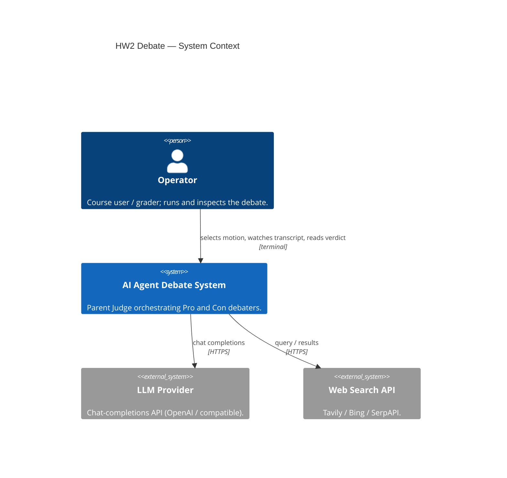
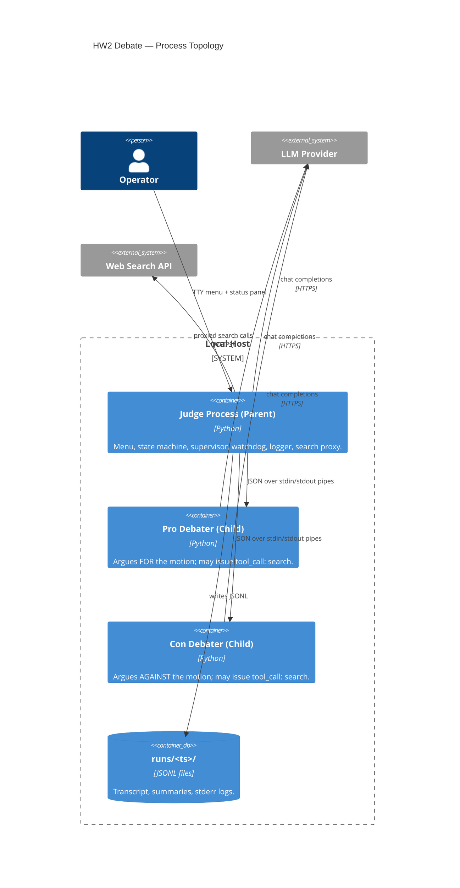
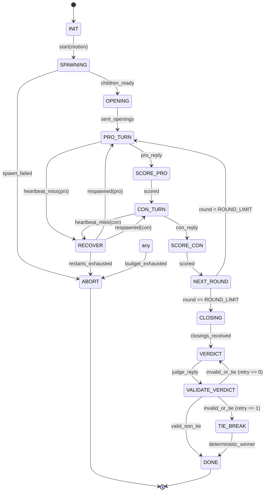

# HW2 AI Agent Debate — Lab Report

A multi-process agentic system in which a **Parent Judge** orchestrates two **Child Debaters** (Pro and Con) through a structured, bounded debate on a user-supplied motion.

## 1. Overview & Architecture

The system enforces a hard token/cost budget, caches internet search tool usage, and automatically recovers from child process crashes mid-debate. All inter-process communication is single-line JSON (`\n` framed) over standard OS pipes.

### System Context


### Process Topology


## 2. How to Run

**Prerequisites:** Python 3.12+ and `uv` installed.

1. **Install Dependencies:**
   ```bash
   python scripts/dev.py setup
   ```
2. **Run the Application:**
   ```bash
   python scripts/dev.py run
   ```

### Menu Walk-through
Upon launch, a rich terminal menu appears:
```
(1) Start debate with default configuration
(2) Choose from starter motions
(3) Enter a custom motion
(4) Edit runtime tunables
(5) Replay a saved run
(6) Quit
```
During a debate, a live status panel refreshes showing current speaker, round count, tokens in/out, USD spent, and elapsed wall-clock time.

## 3. Configuration Reference

**`config/debate.json` Keys**
| Key | Type | Description |
|-----|------|-------------|
| `rounds` | int | Number of back-and-forth exchanges (default: 10) |
| `model` | str | Default LLM model to use |
| `temperature` | float | Sampling temperature |
| `max_tokens_per_turn` | int | Token limit for single response |
| `max_tokens_per_debate` | int | Global budget limit |
| `max_usd_per_debate` | float | Global financial budget |
| `max_requests_per_minute` | int | RPM throttling limit |
| `heartbeat_sec` | float | Watchdog ping interval |
| `heartbeat_timeout_sec` | float | Grace period for a pong reply |
| `max_restarts_per_child` | int | Process crash limits before aborting |
| `max_message_bytes` | int | Payload size bound on JSON over IPC |
| `search` | dict | Search tool provider / cache config |

**`.env` Keys**
| Key | Description |
|-----|-------------|
| `LLM_API_KEY` | Provider key (e.g., OpenAI) |
| `SEARCH_API_KEY` | Web search tool key (e.g., Tavily) |
| `LOG_LEVEL` | Application logging level |

## 4. State Machine & Recovery

The Judge executes a pure, deterministic Finite State Machine (FSM). 



### Recovery Semantics
When the Watchdog observes a missed heartbeat, it kills the misbehaving child, triggers a respawn, and the FSM transitions to `RECOVER`. The Judge replays the exact last outbound context prompt.
If the LLM verdict is malformed twice (e.g., missing reasons or a `"tie"`), a fallback **Tie-Breaker** is deterministically computed based on cumulative running argument scores (with the `con` role breaking exact ties).

## 5. Token Economics

The **Gatekeeper** wraps all LLM and tool calls across all processes. A Ledger accumulates total spent constraints inside a thread-safe mutex.

```json
{
  "tokens_in": 14205,
  "tokens_out": 420,
  "usd_spent": 0.007621,
  "requests": 14,
  "started_at": "2026-05-18T10:00:00Z"
}
```

Calls are estimated *before* outbound dispatch and reconciled with precise usage headers post-reply. Budget violation immediately aborts the run, preventing uncontrolled spend loops.

## 6. Context Engineering

- **Select / Write:** Instead of dumping an infinitely growing transcript, the Judge supplies the child with a minimal subset (system instruction, last opponent reply, and a rolling summary of older points). 
- **Router-Skill caching:** Identical search queries (normalised by NFC/case) are SHA-256 hashed and served from an instance-level dictionary cache, bypassing the Gatekeeper and saving tokens + latency.

## 7. Testing Strategy

- **Unit:** Pure components like the State Machine, Schemas, and the Watchdog ping limits are heavily isolated.
- **Integration:** Stubs mimic LLMs and search providers. Tests verify end-to-end 10-ping debates and replay mechanics.
- **Chaos Matrix:** `SIGKILL` child process crashes, simulated network 429 timeouts, malformed JSON verdict injection, and USD/Token budget truncation.
- **Security Check:** A scanner asserts no keys land in `.stderr.log` artifacts, stdout, or the `git log` history. 

## 8. Known Limitations & Future Work (PRD §10)

- V1 operates linearly — single debate sequence without multi-bracket tournaments.
- No direct Web UI or token streaming (only complete reply updates are passed between processes).
- Local hosting LLMs currently requires compatible API endpoints (no native GGUF/ggml).

## 9. Special Creativity

Beyond the core assignment requirements, several robust architectural improvements were implemented to harden the debate system for production environments:

- **Multi-Stage FSM Failsafes:** Added watchdog heartbeat monitoring and round-level timeouts that safely terminate misbehaving children and gracefully reconstruct state using FSM recovery semantics.
- **Deep Defence Validation:** Implemented regex-based prompt injection detection for user motions to prevent jailbreaks, semantic deduplication of verdict reasons using Jaccard similarity, and clamped score ranges with anomaly detection heuristics.
- **Advanced Tie-Breaking:** In the event of dual validation failures from the LLM, the tie-breaker computes cumulative scores, round-over-round momentum, and standard deviation to determine a statistically sound deterministic winner.
- **Lifecycle Auditing:** Injected comprehensive, structured logging at every FSM transition and child invocation. All logs are securely routed to `stderr` to maintain IPC purity on `stdout`, without triggering security lints (converted all `print` to `sys.stderr.write`).
- **Resilient IPC Flow:** Included rate limiting and schema version checking on all envelopes to prevent runaway LLM loops from flooding the message pipes or exceeding the token budget prematurely.
