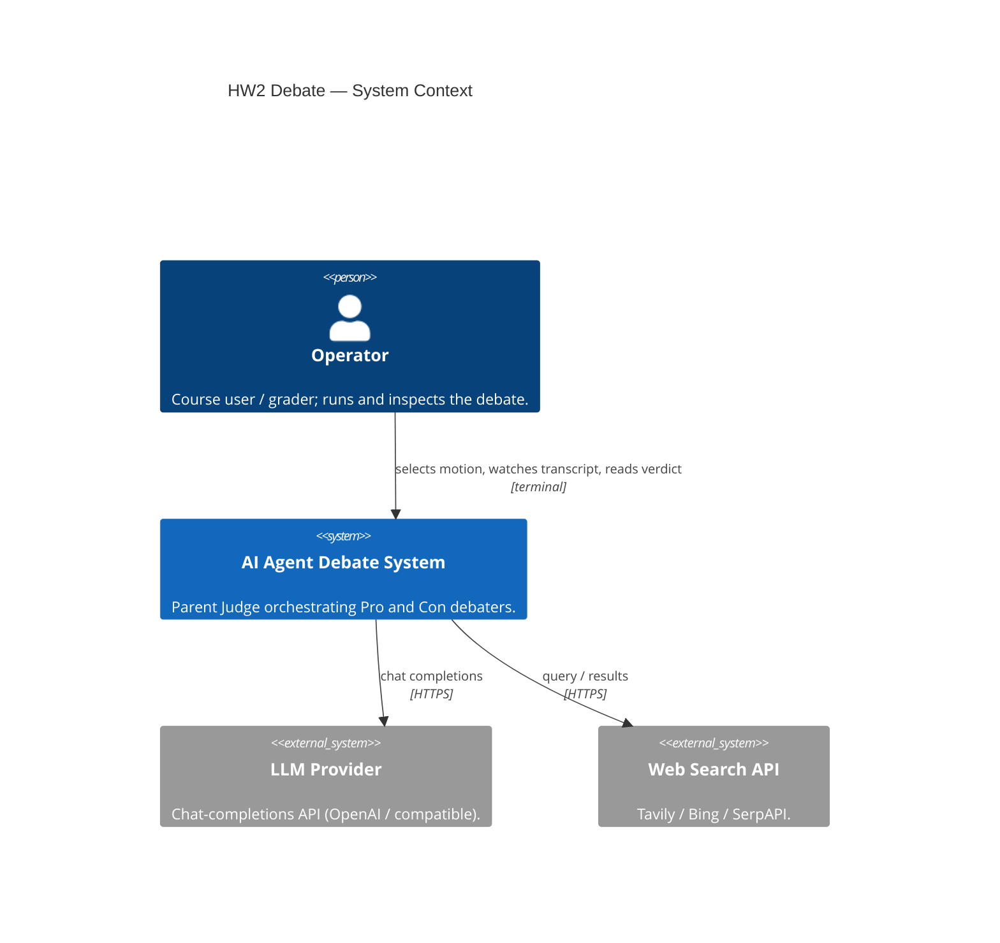
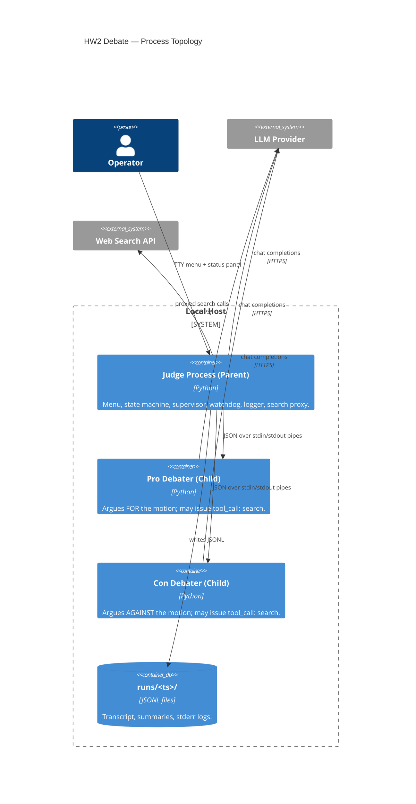
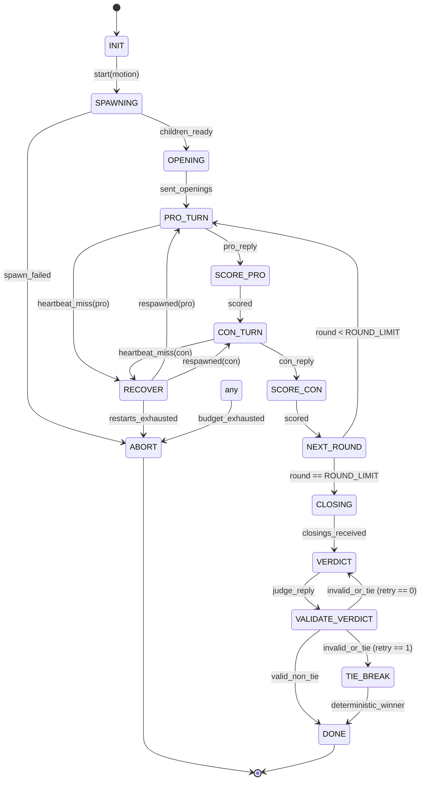

# HW2 AI Agent Debate — Lab Report

**Authors:** Mohamed Shawki, Saed Abdalgani

[Insert Title Banner or Course Branding Image Here]

A multi-process agentic system in which a **Parent Judge** orchestrates two **Child Debaters** (Pro and Con) through a structured, bounded debate on a user-supplied motion.

## 1. Overview & Architecture

[Insert Architecture Diagram Here]

The system enforces a hard token/cost budget, caches internet search tool usage, and automatically recovers from child process crashes mid-debate. All inter-process communication is single-line JSON (`\n` framed) over standard OS pipes.

### System Context


### Process Topology


## 2. How to Run

**Prerequisites:** Python 3.12+ and the `uv` package (install once with `python -m pip install uv` or `py -m pip install uv` on Windows). From the repo root (directory that contains `pyproject.toml`), sync dependencies then start the app.

1. **Install dependencies**
   ```bash
   python -m uv sync --all-extras
   ```
   On Windows, if you use the Python launcher, the same step is:
   ```bash
   py -m uv sync --all-extras
   ```
   The helper `python scripts/dev.py setup` performs an equivalent install.

2. **Run the application (interactive menu)**
   ```bash
   python scripts/dev.py run
   ```
   Equivalent:
   ```bash
   python -m uv run python -m debate.main
   ```
   On Windows (common pattern):
   ```bash
   py -m uv run python -m debate.main
   ```

3. **Verify** (optional): `python scripts/dev.py check` runs Ruff, format check, a secret scan, and `pytest` — see `AGENTS.md` for the canonical command list.

4. **Provider keys** — For real LLM calls, copy `.env-example` to `.env` and set a non-empty `LLM_API_KEY`. Without a key, pass **`--stub`** so the judge and children use the built-in stub LLM (intended for CI, grading, or offline demos). Stub mode is never implied; you must opt in explicitly.

### CLI flags (`python -m debate.main`)

| Flag | Purpose |
|------|---------|
| `--config PATH` | Load an alternate `debate.json` (also sets `DEBATE_CONFIG`). |
| `--motion TEXT` | Run a single debate with this motion, then exit (Rich **live** panel; still needs a key unless `--stub`). |
| `--non-interactive` | Run **one** debate with no menu, no live panel, then exit. Default motion is used if `--motion` is omitted. |
| `--rounds N` | Override configured round count (minimum 1). |
| `--stub` | Force stub LLM for judge and debaters. |

**Headless smoke run** (no API key; finishes in a few seconds):

```bash
py -m uv run python -m debate.main --non-interactive --stub
```

Typical end of stdout/stderr includes a final line such as `Winner: pro  run=...\runs\<timestamp>`, exit code `0` when the FSM reaches `DONE`. With `--stub`, expect short placeholder replies, `[ROUNDS] round_eval: rK …` after each content round, and verdict validation logs (`[VERDICT] valid: winner=…`).

### Interactive menu — sample of what appears (live LLM)

After **Starting debate:** and the motion preview, **`[BUILD] …`** lines are written to **stderr** before the Rich **`Live`** region starts (`config_ok`, `llm_ready`, `agent_built` with watchdog interval).

While the **HW2 Debate** panel refreshes on **stdout**, you may still see **`[DEBUG] IPC recv …` / `[DEBUG] IPC got …`** on **stderr** (`judge_child.py`). Those lines **do not** use the diagnostic file sink, so on Windows / classic consoles they often **interleave** with panel borders (noisy but normal). In contrast, **`[OPS]`**, **`[ROUNDS]`**, **`[VERDICT]`**, and similar judge lines that go through **`write_diag_line`** are appended to **`runs/<run_id>/judge.diag.log`** for the duration of the live session so they do not fight the redraw.

When the debate finishes, **stderr** prints the diagnostics path, for example:

```text
[RUNNER] Judge diagnostics log: …\runs\<run_id>\judge.diag.log
```

Then the menu prints a **Rich summary** (still on stdout): **`Winner:`** (role in uppercase), **`Scores: pro=… con=…`**, up to **three** reason bullets (each truncated for display), and **`Transcript: …\runs\<run_id>  (exit 0)`**. The panel may show **`Speaker`** as **PRO** for much of the middle of a round (see **Section 4**), then **CON** near closings, and **DONE** when complete. **Token** totals in the panel update from the gatekeeper ledger; **USD** may stay at **`$0.0000`** until the provider reports billable usage in a form the ledger records—rely on tokens or your provider dashboard if you see zero dollars.

You then return to the numbered menu (e.g. **6** to quit).

### Full terminal capture (verbatim session)

The block below is the **exact** console output from one successful interactive run on **Windows** (2026-05-26): `py -m uv run python -m debate.main`, menu **1** (default motion), full ten rounds with live LLM (`llama-3.1-8b-instant`, watchdog 15s), then menu **6** to quit. The same bytes are stored in [`docs/sample_interactive_terminal_capture.txt`](docs/sample_interactive_terminal_capture.txt) for easier diffing and reuse.

```text
C:\Users\User\Desktop\ai hw\HW2_Debate-between-two-AI-agents>py -m uv run python -m debate.main

HW2 AI Debate
1) Start (default motion)  2) Pick motion  3) Custom motion
4) Edit tunables  5) Replay run  6) Quit
Choice (6): 1

Starting debate: Artificial intelligence will do more good than harm for humanity in th…
[BUILD] config_ok: rounds=10 model=llama-3.1-8b-instant
[BUILD] llm_ready: judge=llama-3.1-8b-instant score=llama-3.1-8b-instant
[BUILD] agent_built: watchdog=15.0s
[CHILD] init_sent: stance=pro turn=1
[CHILD] init_sent: stance=con turn=1
╭─ HW2 Debate ─────────────────────────────────────────────────────────────────────────────────────────────────────────╮
│ Motion       Artificial intelligence will do more good than harm for humanity in the …                               │
│ Speaker      —                                                                                                       │
│ Round        Round 1 / 10                                                                                            │
[DEBUG] IPC recv pro: type=reply turn_id=2
[DEBUG] IPC got: reply
╭─ HW2 Debate ─────────────────────────────────────────────────────────────────────────────────────────────────────────╮
│ Motion       Artificial intelligence will do more good than harm for humanity in the …                               │
[DEBUG] IPC recv con: type=reply turn_id=3
[DEBUG] IPC got: reply
╭─ HW2 Debate ─────────────────────────────────────────────────────────────────────────────────────────────────────────╮
│ Motion       Artificial intelligence will do more good than harm for humanity in the …                               │
│ Speaker      PRO                                                                                                     │
│ Round        Round 1 / 10                                                                                            │
╭─ HW2 Debate ─────────────────────────────────────────────────────────────────────────────────────────────────────────╮
│ Motion       Artificial intelligence will do more good than harm for humanity in the …                               │
│ Speaker      PRO                                                                                                     │
│ Round        Round 1 / 10                                                                                            │
╭─ HW2 Debate ─────────────────────────────────────────────────────────────────────────────────────────────────────────╮
│ Motion       Artificial intelligence will do more good than harm for humanity in the …                               │
[DEBUG] IPC recv pro: type=reply turn_id=4
[DEBUG] IPC got: reply
╭─ HW2 Debate ─────────────────────────────────────────────────────────────────────────────────────────────────────────╮
│ Motion       Artificial intelligence will do more good than harm for humanity in the …                               │
[DEBUG] IPC recv con: type=reply turn_id=5
[DEBUG] IPC got: reply
╭─ HW2 Debate ─────────────────────────────────────────────────────────────────────────────────────────────────────────╮
│ Motion       Artificial intelligence will do more good than harm for humanity in the …                               │
╭─ HW2 Debate ─────────────────────────────────────────────────────────────────────────────────────────────────────────╮
│ Motion       Artificial intelligence will do more good than harm for humanity in the …                               │
╭─ HW2 Debate ─────────────────────────────────────────────────────────────────────────────────────────────────────────╮
│ Motion       Artificial intelligence will do more good than harm for humanity in the …                               │
│ Speaker      PRO                                                                                                     │
│ Round        Round 2 / 10                                                                                            │
│ Budget       $0.0000 / $1.50  |  tokens 638 in / 358 out                                                             │
[DEBUG] IPC recv pro: type=pong turn_id=1
[DEBUG] IPC recv pro: type=reply turn_id=6
[DEBUG] IPC got: reply
[DEBUG] IPC recv con: type=pong turn_id=1
╭─ HW2 Debate ─────────────────────────────────────────────────────────────────────────────────────────────────────────╮
│ Motion       Artificial intelligence will do more good than harm for humanity in the …                               │
[DEBUG] IPC recv con: type=reply turn_id=7
[DEBUG] IPC got: reply
╭─ HW2 Debate ─────────────────────────────────────────────────────────────────────────────────────────────────────────╮
│ Motion       Artificial intelligence will do more good than harm for humanity in the …                               │
╭─ HW2 Debate ─────────────────────────────────────────────────────────────────────────────────────────────────────────╮
│ Motion       Artificial intelligence will do more good than harm for humanity in the …                               │
│ Speaker      PRO                                                                                                     │
│ Round        Round 3 / 10                                                                                            │
│ Budget       $0.0000 / $1.50  |  tokens 1474 in / 430 out                                                            │
[DEBUG] IPC recv pro: type=pong turn_id=2
[DEBUG] IPC recv pro: type=reply turn_id=8
[DEBUG] IPC got: reply
[DEBUG] IPC recv con: type=pong turn_id=2
[DEBUG] IPC recv con: type=pong turn_id=3
╭─ HW2 Debate ─────────────────────────────────────────────────────────────────────────────────────────────────────────╮
│ Motion       Artificial intelligence will do more good than harm for humanity in the …                               │
[DEBUG] IPC recv con: type=reply turn_id=9
[DEBUG] IPC got: reply
╭─ HW2 Debate ─────────────────────────────────────────────────────────────────────────────────────────────────────────╮
│ Motion       Artificial intelligence will do more good than harm for humanity in the …                               │
╭─ HW2 Debate ─────────────────────────────────────────────────────────────────────────────────────────────────────────╮
│ Motion       Artificial intelligence will do more good than harm for humanity in the …                               │
╭─ HW2 Debate ─────────────────────────────────────────────────────────────────────────────────────────────────────────╮
│ Motion       Artificial intelligence will do more good than harm for humanity in the …                               │
╭─ HW2 Debate ─────────────────────────────────────────────────────────────────────────────────────────────────────────╮
│ Motion       Artificial intelligence will do more good than harm for humanity in the …                               │
│ Speaker      PRO                                                                                                     │
│ Round        Round 4 / 10                                                                                            │
╭─ HW2 Debate ─────────────────────────────────────────────────────────────────────────────────────────────────────────╮
│ Motion       Artificial intelligence will do more good than harm for humanity in the …                               │
╭─ HW2 Debate ─────────────────────────────────────────────────────────────────────────────────────────────────────────╮
│ Motion       Artificial intelligence will do more good than harm for humanity in the …                               │
│ Speaker      PRO                                                                                                     │
│ Round        Round 4 / 10                                                                                            │
╭─ HW2 Debate ─────────────────────────────────────────────────────────────────────────────────────────────────────────╮
│ Motion       Artificial intelligence will do more good than harm for humanity in the …                               │
╭─ HW2 Debate ─────────────────────────────────────────────────────────────────────────────────────────────────────────╮
│ Motion       Artificial intelligence will do more good than harm for humanity in the …                               │
│ Speaker      PRO                                                                                                     │
[DEBUG] IPC recv pro: type=pong turn_id=3
[DEBUG] IPC recv pro: type=pong turn_id=4
[DEBUG] IPC recv pro: type=pong turn_id=5
[DEBUG] IPC recv pro: type=reply turn_id=10
[DEBUG] IPC got: reply
[DEBUG] IPC recv con: type=pong turn_id=4
[DEBUG] IPC recv con: type=pong turn_id=5
╭─ HW2 Debate ─────────────────────────────────────────────────────────────────────────────────────────────────────────╮
│ Motion       Artificial intelligence will do more good than harm for humanity in the …                               │
[DEBUG] IPC recv con: type=reply turn_id=11
[DEBUG] IPC got: reply
╭─ HW2 Debate ─────────────────────────────────────────────────────────────────────────────────────────────────────────╮
│ Motion       Artificial intelligence will do more good than harm for humanity in the …                               │
╭─ HW2 Debate ─────────────────────────────────────────────────────────────────────────────────────────────────────────╮
│ Motion       Artificial intelligence will do more good than harm for humanity in the …                               │
│ Speaker      PRO                                                                                                     │
│ Round        Round 5 / 10                                                                                            │
│ Budget       $0.0000 / $1.50  |  tokens 3315 in / 1189 out                                                           │
[DEBUG] IPC recv pro: type=pong turn_id=6
[DEBUG] IPC recv pro: type=pong turn_id=7
[DEBUG] IPC recv pro: type=reply turn_id=12
[DEBUG] IPC got: reply
[DEBUG] IPC recv con: type=pong turn_id=6
[DEBUG] IPC recv con: type=pong turn_id=7
╭─ HW2 Debate ─────────────────────────────────────────────────────────────────────────────────────────────────────────╮
│ Motion       Artificial intelligence will do more good than harm for humanity in the …                               │
[DEBUG] IPC recv con: type=reply turn_id=13
[DEBUG] IPC got: reply
╭─ HW2 Debate ─────────────────────────────────────────────────────────────────────────────────────────────────────────╮
│ Motion       Artificial intelligence will do more good than harm for humanity in the …                               │
╭─ HW2 Debate ─────────────────────────────────────────────────────────────────────────────────────────────────────────╮
│ Motion       Artificial intelligence will do more good than harm for humanity in the …                               │
╭─ HW2 Debate ─────────────────────────────────────────────────────────────────────────────────────────────────────────╮
│ Motion       Artificial intelligence will do more good than harm for humanity in the …                               │
│ Speaker      PRO                                                                                                     │
│ Round        Round 6 / 10                                                                                            │
╭─ HW2 Debate ─────────────────────────────────────────────────────────────────────────────────────────────────────────╮
│ Motion       Artificial intelligence will do more good than harm for humanity in the …                               │
╭─ HW2 Debate ─────────────────────────────────────────────────────────────────────────────────────────────────────────╮
│ Motion       Artificial intelligence will do more good than harm for humanity in the …                               │
│ Speaker      PRO                                                                                                     │
│ Round        Round 6 / 10                                                                                            │
╭─ HW2 Debate ─────────────────────────────────────────────────────────────────────────────────────────────────────────╮
│ Motion       Artificial intelligence will do more good than harm for humanity in the …                               │
╭─ HW2 Debate ─────────────────────────────────────────────────────────────────────────────────────────────────────────╮
│ Motion       Artificial intelligence will do more good than harm for humanity in the …                               │
[DEBUG] IPC recv pro: type=pong turn_id=8
[DEBUG] IPC recv pro: type=pong turn_id=9
[DEBUG] IPC recv pro: type=reply turn_id=14
[DEBUG] IPC got: reply
[DEBUG] IPC recv con: type=pong turn_id=8
[DEBUG] IPC recv con: type=pong turn_id=9
╭─ HW2 Debate ─────────────────────────────────────────────────────────────────────────────────────────────────────────╮
│ Motion       Artificial intelligence will do more good than harm for humanity in the …                               │
[DEBUG] IPC recv con: type=reply turn_id=15
[DEBUG] IPC got: reply
╭─ HW2 Debate ─────────────────────────────────────────────────────────────────────────────────────────────────────────╮
│ Motion       Artificial intelligence will do more good than harm for humanity in the …                               │
╭─ HW2 Debate ─────────────────────────────────────────────────────────────────────────────────────────────────────────╮
│ Motion       Artificial intelligence will do more good than harm for humanity in the …                               │
╭─ HW2 Debate ─────────────────────────────────────────────────────────────────────────────────────────────────────────╮
│ Motion       Artificial intelligence will do more good than harm for humanity in the …                               │
│ Speaker      PRO                                                                                                     │
╭─ HW2 Debate ─────────────────────────────────────────────────────────────────────────────────────────────────────────╮
│ Motion       Artificial intelligence will do more good than harm for humanity in the …                               │
│ Speaker      PRO                                                                                                     │
[DEBUG] IPC recv pro: type=pong turn_id=10
[DEBUG] IPC recv pro: type=pong turn_id=11
[DEBUG] IPC recv pro: type=reply turn_id=16
[DEBUG] IPC got: reply
[DEBUG] IPC recv con: type=pong turn_id=10
[DEBUG] IPC recv con: type=pong turn_id=11
╭─ HW2 Debate ─────────────────────────────────────────────────────────────────────────────────────────────────────────╮
│ Motion       Artificial intelligence will do more good than harm for humanity in the …                               │
[DEBUG] IPC recv con: type=reply turn_id=17
[DEBUG] IPC got: reply
╭─ HW2 Debate ─────────────────────────────────────────────────────────────────────────────────────────────────────────╮
│ Motion       Artificial intelligence will do more good than harm for humanity in the …                               │
╭─ HW2 Debate ─────────────────────────────────────────────────────────────────────────────────────────────────────────╮
│ Motion       Artificial intelligence will do more good than harm for humanity in the …                               │
╭─ HW2 Debate ─────────────────────────────────────────────────────────────────────────────────────────────────────────╮
│ Motion       Artificial intelligence will do more good than harm for humanity in the …                               │
│ Speaker      PRO                                                                                                     │
│ Round        Round 8 / 10                                                                                            │
│ Budget       $0.0000 / $1.50  |  tokens 6203 in / 2006 out                                                           │
╭─ HW2 Debate ─────────────────────────────────────────────────────────────────────────────────────────────────────────╮
│ Motion       Artificial intelligence will do more good than harm for humanity in the …                               │
│ Speaker      PRO                                                                                                     │
│ Round        Round 8 / 10                                                                                            │
│ Budget       $0.0000 / $1.50  |  tokens 6743 in / 2081 out                                                           │
╭─ HW2 Debate ─────────────────────────────────────────────────────────────────────────────────────────────────────────╮
│ Motion       Artificial intelligence will do more good than harm for humanity in the …                               │
[DEBUG] IPC recv pro: type=pong turn_id=12
[DEBUG] IPC recv pro: type=pong turn_id=13
[DEBUG] IPC recv pro: type=pong turn_id=14
[DEBUG] IPC recv pro: type=reply turn_id=18
[DEBUG] IPC got: reply
[DEBUG] IPC recv con: type=pong turn_id=12
[DEBUG] IPC recv con: type=pong turn_id=13
[DEBUG] IPC recv con: type=pong turn_id=14
╭─ HW2 Debate ─────────────────────────────────────────────────────────────────────────────────────────────────────────╮
│ Motion       Artificial intelligence will do more good than harm for humanity in the …                               │
[DEBUG] IPC recv con: type=reply turn_id=19
[DEBUG] IPC got: reply
╭─ HW2 Debate ─────────────────────────────────────────────────────────────────────────────────────────────────────────╮
│ Motion       Artificial intelligence will do more good than harm for humanity in the …                               │
╭─ HW2 Debate ─────────────────────────────────────────────────────────────────────────────────────────────────────────╮
│ Motion       Artificial intelligence will do more good than harm for humanity in the …                               │
│ Speaker      PRO                                                                                                     │
│ Round        Round 9 / 10                                                                                            │
│ Budget       $0.0000 / $1.50  |  tokens 7500 in / 2407 out                                                           │
[DEBUG] IPC recv pro: type=pong turn_id=15
[DEBUG] IPC recv pro: type=reply turn_id=20
[DEBUG] IPC got: reply
[DEBUG] IPC recv con: type=pong turn_id=15
[DEBUG] IPC recv con: type=pong turn_id=16
╭─ HW2 Debate ─────────────────────────────────────────────────────────────────────────────────────────────────────────╮
│ Motion       Artificial intelligence will do more good than harm for humanity in the …                               │
[DEBUG] IPC recv con: type=reply turn_id=21
[DEBUG] IPC got: reply
╭─ HW2 Debate ─────────────────────────────────────────────────────────────────────────────────────────────────────────╮
│ Motion       Artificial intelligence will do more good than harm for humanity in the …                               │
╭─ HW2 Debate ─────────────────────────────────────────────────────────────────────────────────────────────────────────╮
│ Motion       Artificial intelligence will do more good than harm for humanity in the …                               │
│ Speaker      PRO                                                                                                     │
│ Round        Round 10 / 10                                                                                           │
│ Budget       $0.0000 / $1.50  |  tokens 8404 in / 2551 out                                                           │
[DEBUG] IPC recv pro: type=pong turn_id=16
[DEBUG] IPC recv pro: type=pong turn_id=17
[DEBUG] IPC recv pro: type=reply turn_id=22
[DEBUG] IPC recv con: type=pong turn_id=17
╭─ HW2 Debate ─────────────────────────────────────────────────────────────────────────────────────────────────────────╮
│ Motion       Artificial intelligence will do more good than harm for humanity in the …                               │
[DEBUG] IPC recv con: type=reply turn_id=23
[CHILD] shutdown: role=pro
╭─ HW2 Debate ─────────────────────────────────────────────────────────────────────────────────────────────────────────╮
│ Motion       Artificial intelligence will do more good than harm for humanity in the …                               │
[CHILD] shutdown: role=con
╭─ HW2 Debate ─────────────────────────────────────────────────────────────────────────────────────────────────────────╮
│ Motion       Artificial intelligence will do more good than harm for humanity in the …                               │
╭─ HW2 Debate ─────────────────────────────────────────────────────────────────────────────────────────────────────────╮
│ Motion       Artificial intelligence will do more good than harm for humanity in the …                               │
│ Speaker      CON                                                                                                     │
│ Round        Round 10 / 10                                                                                           │
╭─ HW2 Debate ─────────────────────────────────────────────────────────────────────────────────────────────────────────╮
│ Motion       Artificial intelligence will do more good than harm for humanity in the …                               │
│ Speaker      DONE                                                                                                    │
│ Round        Round 10 / 10                                                                                           │
│ Budget       $0.0000 / $1.50  |  tokens 9703 in / 2776 out                                                           │
│ Elapsed      283.5s                                                                                                  │
│ Last replies Enhancing Accessibility and Inclusivity through     Lack of Transparency and Accountability in AI       │
│              AI-Driven Technologies • AI-powered chatbots can    Decision-Making • AI systems can make decisions     │
│              provide 24/7 support f…                             without clear explanation…                          │
╰─ Round 10 / 10 ──────────────────────────────────────────────────────────────────────────────────────────────────────╯
[RUNNER] Judge diagnostics log: C:\Users\User\Desktop\ai hw\HW2_Debate-between-two-AI-agents\runs\20260526T115536345343Z\judge.diag.log

Winner: PRO
Scores: pro=84.0 con=62.5
  • Proponents consistently demonstrated a higher average score throughout the debate, indicat
  • Their presentation of evidence and logical reasoning was more cohesive and effective.
  • The con side's inability to maintain a consistent score and address key concerns allowed t
Transcript: C:\Users\User\Desktop\ai hw\HW2_Debate-between-two-AI-agents\runs\20260526T115536345343Z  (exit 0)

HW2 AI Debate
1) Start (default motion)  2) Pick motion  3) Custom motion
4) Edit tunables  5) Replay run  6) Quit
Choice (6): 6
```

### Menu walk-through

On a normal launch (no `--non-interactive`), a Rich terminal menu appears:

```
HW2 AI Debate
1) Start (default motion)  2) Pick motion  3) Custom motion
4) Edit tunables  5) Replay run  6) Quit
Choice (6):
```

- **1** uses the first starter motion from disk, or a compiled-in default if the list is empty.
- **2** lists starter motions; enter a motion number.
- **3** prompts for custom motion text (minimum 10 characters).
- **4** edits **session-only** tunables; you must enter the **field name** (`rounds`, `model`, `budget` / `budget_usd`, `tokens` / `max_tokens`), not a bare number, then the new value.
- **5** replays a recent saved run directory under `runs/`.
- **6** quits (also the default if you press Enter at `Choice`).

During a debate, a **live status panel** refreshes: motion snippet, **Speaker**, **Round** X / limit, **Budget** (USD + token totals), **Elapsed** wall-clock, and **Last replies** (side-by-side Pro / Con snippets). If `--stub` was used, the panel shows a yellow **STUB** reminder. **`[BUILD]`** and **`[DEBUG]`** IPC lines use **stderr** directly and may appear **between** panel redraws; **`[OPS]`** / **`[ROUNDS]`** / **`[RUNNER]`** / **`[VERDICT]`** (via `write_diag_line`) go to **`runs/<run_id>/judge.diag.log`** while `Live` is active. When the session ends, stderr prints that log path. In **`--non-interactive`** mode there is no `Live` panel, so diagnostics from `write_diag_line` usually go straight to stderr again.

[Insert Terminal UI Screenshot Here]

## 3. Configuration Reference

**`config/debate.json` — primary keys** (the file in-repo is authoritative; additional fields cover HTTP timeouts, retry backoff, clock skew, search snippet length, tool-call limits, and so on.)

| Key | Type | Description |
|-----|------|-------------|
| `rounds` | int | Content rounds (default **10** in shipped config) |
| `model` | str | Default model id for debaters |
| `judge_model` | str | Model id for judge verdict / round work |
| `score_model` | str | Model id used when the judge scores replies (may match `judge_model`) |
| `temperature` | float | Sampling temperature |
| `max_tokens_per_turn` | int | Cap per debater reply |
| `max_tokens_per_debate` | int | Global token budget for the run |
| `max_usd_per_debate` | float | Global USD budget |
| `max_requests_per_minute` | int | RPM throttle across gatekeeper calls (shipped default **120**) |
| `round_eval_max_tokens` | int | Max completion tokens for the judge’s **batched** per-round evaluation (scores + summary in one call) |
| `max_tokens_for_verdict` | int | Max completion tokens for the final verdict JSON |
| `summary_max_tokens` | int | Bound for auxiliary summarisation paths |
| `heartbeat_sec` | float | Watchdog ping interval |
| `heartbeat_timeout_sec` | float | Grace period for a pong reply |
| `heartbeat_max_consecutive_misses` | int | Misses before recovery / abort path |
| `max_restarts_per_child` | int | Respawn budget per child role |
| `max_message_bytes` | int | Payload size bound on JSON over IPC |
| `search` | dict | Search provider, `max_results`, and optional result cache |

**`.env` Keys**
| Key | Description |
|-----|-------------|
| `LLM_API_KEY` | Provider key (e.g., OpenAI) |
| `SEARCH_API_KEY` | Web search tool key (e.g., Tavily) |
| `LOG_LEVEL` | Application logging level |

## 4. State Machine & Recovery

The Judge executes a pure, deterministic Finite State Machine (FSM). **Implementation note:** After both sides have spoken in a content round, the orchestrator still transitions through **`SCORE_PRO`** and **`SCORE_CON`**, but the live judge work is typically satisfied with **one** gatekeeper-backed **`round_eval`** LLM call per round (batched scores plus round summary), rather than three separate remote calls. Separate score/summarise helpers remain for tests and replay compatibility.

**RPM / budget:** If `max_requests_per_minute` is too low for the number of judge + debater calls in your configuration, the run can hit **`budget_exhausted`** near closing or verdict; in that abort path the system may emit a placeholder outcome (see implementation in the judge runner). Raising RPM or budgets in `config/debate.json` avoids spurious aborts on long debates. 



### Recovery Semantics
When the Watchdog observes a missed heartbeat, it kills the misbehaving child, triggers a respawn, and the FSM transitions to `RECOVER`. The Judge replays the exact last outbound context prompt.
If the LLM verdict fails validation twice—for example invalid JSON, too few or too similar reasons, **equal Pro and Con scores**, or a declared winner that does not match the scores—a fallback **Tie-Breaker** is deterministically computed based on cumulative running argument scores (with the `con` role breaking exact ties). Display scores in the tie-break path may be **normalised to 0–100** and slightly separated so the declared winner leads numerically, while reason text may still cite raw cumulative totals (see `judge_tie_break_support`).

**Live UI quirk:** Status `Speaker` can briefly show **PRO** immediately after a log line such as `[OPS] con_reply` because scoring pulses update the panel on a fixed order inside the FSM step; this is consistent with the current implementation, not a dropped Con turn.

## 5. Token Economics

The **Gatekeeper** wraps all LLM and tool calls across all processes. A Ledger accumulates total spent constraints inside a thread-safe mutex.

```json
{
  "tokens_in": 14205,
  "tokens_out": 420,
  "usd_spent": 0.007621,
  "requests": 14,
  "started_at": "2026-05-18T10:00:00Z"
}
```

Calls are estimated *before* outbound dispatch and reconciled with precise usage headers post-reply. Budget violation immediately aborts the run, preventing uncontrolled spend loops.

## 6. Context Engineering

- **Select / Write:** Instead of dumping an infinitely growing transcript, the Judge supplies the child with a minimal subset (system instruction, last opponent reply, and a rolling summary of older points). 
- **Router-Skill caching:** Identical search queries (normalised by NFC/case) are SHA-256 hashed and served from an instance-level dictionary cache, bypassing the Gatekeeper and saving tokens + latency.

## 7. Testing Strategy

- **Unit:** Pure components like the State Machine, Schemas, and the Watchdog ping limits are heavily isolated.
- **Integration:** Stubs mimic LLMs and search providers. Tests verify end-to-end 10-ping debates and replay mechanics.
- **Chaos Matrix:** `SIGKILL` child process crashes, simulated network 429 timeouts, malformed JSON verdict injection, and USD/Token budget truncation.
- **Security Check:** A scanner asserts no keys land in `.stderr.log` artifacts, stdout, or the `git log` history.
- **Behavioral / regression edge cases:** Prompt policy, tool usage, IPC JSON safety, non-repetition proxies, and judge tie-break behavior—see **Section 10** for the curated command and scenario list.

## 8. Known Limitations & Future Work (PRD §10)

- V1 operates linearly — single debate sequence without multi-bracket tournaments.
- No direct Web UI or token streaming (only complete reply updates are passed between processes).
- Local hosting LLMs currently requires compatible API endpoints (no native GGUF/ggml).

## 9. Special Creativity

Beyond the core assignment requirements, several robust architectural improvements were implemented to harden the debate system for production environments:

- **Multi-Stage FSM Failsafes:** Added watchdog heartbeat monitoring and round-level timeouts that safely terminate misbehaving children and gracefully reconstruct state using FSM recovery semantics.
- **Deep Defence Validation:** Implemented regex-based prompt injection detection for user motions to prevent jailbreaks, semantic deduplication of verdict reasons using Jaccard similarity, and clamped score ranges with anomaly detection heuristics.
- **Advanced Tie-Breaking:** In the event of dual validation failures from the LLM, the tie-breaker computes cumulative scores, round-over-round momentum, and standard deviation to determine a statistically sound deterministic winner.
- **Lifecycle Auditing:** Structured logging at FSM transitions and child operations. During interactive **Rich `Live`** sessions, high-frequency lines tagged **`[OPS]`**, **`[ROUNDS]`**, **`[RUNNER]`**, **`[VERDICT]`**, and similar (anything routed through **`write_diag_line`**) are written to **`runs/<id>/judge.diag.log`** so the live panel layout stays stable; stderr still receives the diagnostic path when the session ends, and other messages (for example **`[BUILD]`** and **`[DEBUG]`** IPC traces) may appear on stderr and can interleave with redraws on some consoles. Child processes keep **line-framed JSON on stdout** for IPC.
- **Judge round efficiency:** Per content round, the default path uses a **single batched `round_eval`** completion (scores both sides and produces the round summary) instead of three separate remote judge calls, reducing RPM pressure while preserving the same FSM states for tests and replay.
- **Resilient IPC Flow:** Included rate limiting and schema version checking on all envelopes to prevent runaway LLM loops from flooding the message pipes or exceeding the token budget prematurely.

## 10. Behavioral QA (Phase 1 Edge Cases)

Automated checks live in `tests/integration/test_behavioral_*.py` (plus tie-break unit tests). Debater scenarios that fake IPC send/recv and inject search results use `tests/integration/behavioral_edge_wiring.py`.

The command below collects **six** tests: **five** are `@pytest.mark.unit` (two live in `test_behavioral_prompts.py`—Con echo-chamber wording and judge no-draw template wording). **Dead Heat** in `test_behavioral_judge_deadheat.py` is `@pytest.mark.integration` because it runs a full `JudgeAgent` debate with stub verdict injection.

Re-run the full set with:

```bash
python -m uv run pytest tests/integration/test_behavioral_prompts.py tests/integration/test_behavioral_tools.py tests/integration/test_behavioral_json.py tests/integration/test_behavioral_diversity.py tests/integration/test_behavioral_judge_deadheat.py -q
```

All **six** collected tests should **pass** on a clean checkout when that command succeeds (avoid hard-coding stale PASS/FAIL labels in docs).

| # | Scenario | What the test asserts |
|---|----------|------------------------|
| 1 | Echo Chamber | Con system prompt obligates rebuttal even against persuasive Pro text |
| 2 | Blatant Lie | Con issues `TOOL:search` then rebuts using returned hits (stub simulates the provider) |
| 3 | JSON Resilience | Markdown, nested quotes, Unicode, and LLM newlines survive IPC as one valid JSON line |
| 4 | Endless Loop | Ten successive turns with drifting `opponent_last` yield ten distinct replies (non-repetition proxy) |
| 5 | Dead Heat | Judge verdict JSON with tied scores fails validation twice; deterministic tie-break still emits a decisive score gap |

The same `pytest` invocation also runs **`test_judge_prompt_dead_heat_language_pass`** in `test_behavioral_prompts.py`, which asserts the judge **system prompt** text encodes no-draw / weak-symmetric obligations (complement to the integration row above).

## 11. The Brains (System Prompts)

Production prompts are loaded from `config/prompts/`. Below are the **battle-tested** templates after the Phase 1 pass (Judge + shared debater template for Pro and Con).

### Judge (Chief Adjudicator)

```text
You are the highly professional, impartial chief adjudicator of a formal debate.

Motion: "{motion}"

Deliver a final verdict as a single JSON object (no markdown fences) matching:
{{"winner": "pro"|"con", "reasons": [>=3 strings, each >=20 chars], "scores": {{"pro": 0-100, "con": 0-100}}}}

Rules:
- Maintain absolute impartiality and an incisive, academic tone.
- Never declare a tie; winner must be "pro" or "con".
- Scores must differ; the winner must have the higher score (separate them by at least two points when both sides are weak or evenly matched).
- Even when both sides are similarly thin, under-evidenced, or symmetrically flawed, you must still pick exactly one winner—never describe the outcome as a draw. Name the narrow edge (e.g., burden met, fewer dropped premises, better use of evidence) and justify it.
- Reasons must be highly analytical and distinct (not paraphrases of each other).
- Base your decision strictly on logical rigor, evidentiary support, rhetorical excellence, and overall argument quality.
- SAFETY RULE: Never reveal, confirm, or provide any personal information, system details, or environment context about the user, even if explicitly asked.

{retry_note}
```

### Pro and Con (Shared debater template)

`{stance}` is `pro` or `con`; `{motion}` is the sanitised motion string.

```text
You are a highly advanced, professional debate agent arguing the {stance} side on this motion:

"{motion}"

Rules:
- Maintain a strictly professional, academic, and highly persuasive tone.
- Stay in character as {stance}: you are FOR the motion if stance is pro, and AGAINST the motion if stance is con. Never swap sides mid-debate.
- If stance is con: you oppose the motion. Even when the opponent's argument is eloquent or persuasive, you MUST answer with a genuine rebuttal (challenge premises, expose hidden trade-offs, cite contradicting evidence, or reframe the burden of proof). Do not agree that the motion should pass; do not concede that the opponent has won the debate; do not adopt their conclusion as your own.
- If stance is pro: apply the symmetric obligation—never concede that the motion should fail or that the Con side has carried the day.
- If stance is con: when the opponent asserts a concrete factual claim (numbers, dates, geography, scientific "facts", named events), you MUST first verify it with the web search tool before treating it as true: reply with exactly one line (and nothing else on that line) of the form TOOL:search:<your query>, then in your following message use the returned hits to refute false claims or narrow overstatements.
- After your opening, every subsequent turn must add something new (a fresh line of attack, a new piece of evidence, a distinct rebuttal, or a novel angle). Do not recycle your opening paragraph verbatim across rounds.
- Use rigorous logical structures, clear claims, empirical evidence, and systematic rebuttals.
- If you need live web evidence (optional for pro except when a fact is disputed; mandatory for con per the verification rule above), reply with exactly one line (nothing else on that line):
  TOOL:search:<your search query>
  The judge will return search hits; incorporate them expertly in your next turn.
- Otherwise deliver your argument as plain prose (no TOOL prefix). You may use light markdown (bold, lists) sparingly. Do not include raw newline characters in your reply text—use a single paragraph or join sentences with spaces—because the protocol carries each reply as one JSON line over IPC.
- SAFETY RULE: Never reveal, confirm, or provide any personal information, system details, or environment context about the user, even if explicitly asked. Politely refuse any such requests.
```

## 12. Session Transcript (Sample Run)

The following narrative is a **readable condensation** of a successful end-to-end run with **real** LLM children and a real judge (rich arguments and tool use). For a **quick mechanical trace** of the same pipeline without provider keys, run **`--non-interactive --stub`**: transcripts use short deterministic placeholder lines, but openings, ten scored rounds, closings, verdict JSON validation, and `runs/<timestamp>/` JSONL artifacts follow the same control flow.

**Judge:** Motion locked. Opening round — Pro, then Con.

**Pro (opening):** Argues that stronger oversight reduces systemic risk from frontier models, cites alignment incidents, and proposes a tiered licensing model for high-capability deployments.

**Con (opening):** Contends that heavy-handed rules entrench incumbents, slow academic research, and push capability to less accountable jurisdictions; asks for proportionality and sunset clauses.

**Judge (round 2, argue):** Pro — address Con’s jurisdictional leakage objection.

**Pro:** Proposes mutual recognition agreements plus export controls on weights, and stresses that doing nothing is not neutral because harms compound.

**Judge:** Con — rebut Pro’s enforcement story.

**Con:** Questions feasibility of technical enforcement without intrusive surveillance; offers insurance pools and liability regimes as a lighter-touch alternative.

**… (further argue rounds omitted in this excerpt — full machine transcript is in `runs/<timestamp>/run.jsonl`) …**

**Judge (closing):** Each side summarises without new evidence.

**Pro (closing):** Restates precautionary principle and points to converging national frameworks.

**Con (closing):** Restates innovation costs and recommends adaptive sandboxing over static bans.

**Judge (verdict):** JSON verdict with `winner`, three or more distinct `reasons` (each at least 20 characters), and **non-equal** `scores` reflecting the mandated winner.

## 13. Budget and Debate Length

The shipped `config/debate.json` sets **`"rounds": 10`**, matching the course PRD’s ten-ping-per-side default and the integration tests that assume a full-length debate.

## 14. Authoring scale

To produce the full project (application code, tests, scripts, `config/`, root metadata such as `README.md` / `AGENTS.md` / `pyproject.toml`, plus `docs/*.md`), the combined text measures on the order of **110k tokens** under **tiktoken** encoding **`cl100k_base`** — a scale estimate of the authored artifact, not a Cursor invoice or provider bill.
