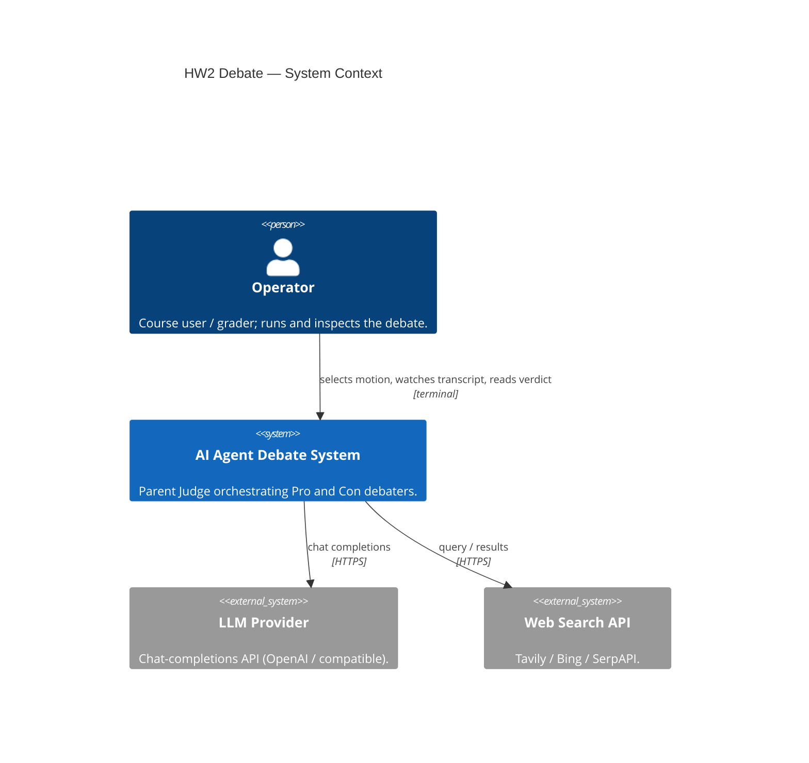
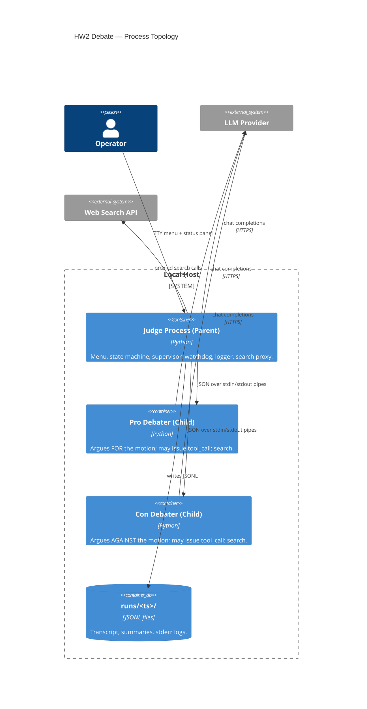
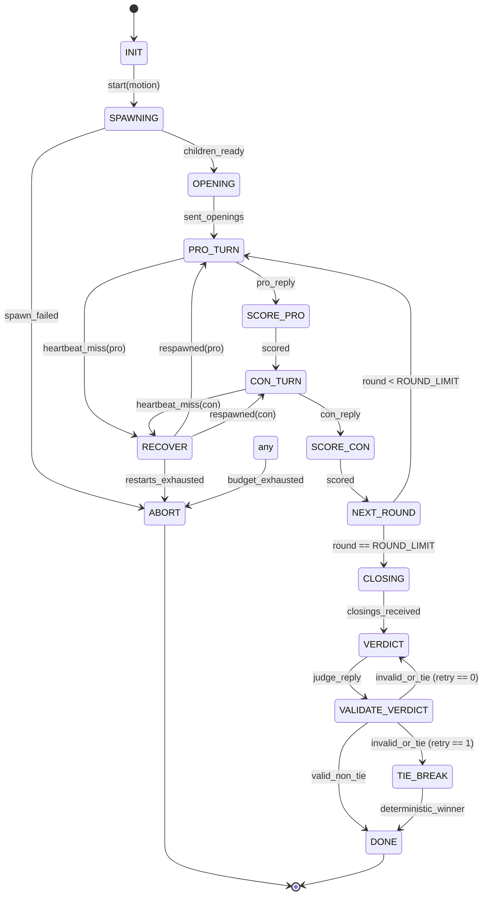

# HW2 AI Agent Debate — Lab Report

**Authors:** Mohamed Shawki, Saed Abdalgani

[Insert Title Banner or Course Branding Image Here]

A multi-process agentic system in which a **Parent Judge** orchestrates two **Child Debaters** (Pro and Con) through a structured, bounded debate on a user-supplied motion.

## 1. Overview & Architecture

[Insert Architecture Diagram Here]

The system enforces a hard token/cost budget, caches internet search tool usage, and automatically recovers from child process crashes mid-debate. All inter-process communication is single-line JSON (`\n` framed) over standard OS pipes.

### System Context


### Process Topology


## 2. How to Run

**Prerequisites:** Python 3.12+ and `uv` installed.

1. **Install Dependencies:**
   ```bash
   python scripts/dev.py setup
   ```
2. **Run the Application:**
   ```bash
   python scripts/dev.py run
   ```

### Menu Walk-through
Upon launch, a rich terminal menu appears:
```
(1) Start debate with default configuration
(2) Choose from starter motions
(3) Enter a custom motion
(4) Edit runtime tunables
(5) Replay a saved run
(6) Quit
```
During a debate, a live status panel refreshes showing current speaker, round count, tokens in/out, USD spent, and elapsed wall-clock time.

[Insert Terminal UI Screenshot Here]

## 3. Configuration Reference

**`config/debate.json` Keys**
| Key | Type | Description |
|-----|------|-------------|
| `rounds` | int | Number of back-and-forth exchanges (default: 10) |
| `model` | str | Default LLM model to use |
| `temperature` | float | Sampling temperature |
| `max_tokens_per_turn` | int | Token limit for single response |
| `max_tokens_per_debate` | int | Global budget limit |
| `max_usd_per_debate` | float | Global financial budget |
| `max_requests_per_minute` | int | RPM throttling limit |
| `heartbeat_sec` | float | Watchdog ping interval |
| `heartbeat_timeout_sec` | float | Grace period for a pong reply |
| `max_restarts_per_child` | int | Process crash limits before aborting |
| `max_message_bytes` | int | Payload size bound on JSON over IPC |
| `search` | dict | Search tool provider / cache config |

**`.env` Keys**
| Key | Description |
|-----|-------------|
| `LLM_API_KEY` | Provider key (e.g., OpenAI) |
| `SEARCH_API_KEY` | Web search tool key (e.g., Tavily) |
| `LOG_LEVEL` | Application logging level |

## 4. State Machine & Recovery

The Judge executes a pure, deterministic Finite State Machine (FSM). 



### Recovery Semantics
When the Watchdog observes a missed heartbeat, it kills the misbehaving child, triggers a respawn, and the FSM transitions to `RECOVER`. The Judge replays the exact last outbound context prompt.
If the LLM verdict fails validation twice—for example invalid JSON, too few or too similar reasons, **equal Pro and Con scores**, or a declared winner that does not match the scores—a fallback **Tie-Breaker** is deterministically computed based on cumulative running argument scores (with the `con` role breaking exact ties).

## 5. Token Economics

The **Gatekeeper** wraps all LLM and tool calls across all processes. A Ledger accumulates total spent constraints inside a thread-safe mutex.

```json
{
  "tokens_in": 14205,
  "tokens_out": 420,
  "usd_spent": 0.007621,
  "requests": 14,
  "started_at": "2026-05-18T10:00:00Z"
}
```

Calls are estimated *before* outbound dispatch and reconciled with precise usage headers post-reply. Budget violation immediately aborts the run, preventing uncontrolled spend loops.

## 6. Context Engineering

- **Select / Write:** Instead of dumping an infinitely growing transcript, the Judge supplies the child with a minimal subset (system instruction, last opponent reply, and a rolling summary of older points). 
- **Router-Skill caching:** Identical search queries (normalised by NFC/case) are SHA-256 hashed and served from an instance-level dictionary cache, bypassing the Gatekeeper and saving tokens + latency.

## 7. Testing Strategy

- **Unit:** Pure components like the State Machine, Schemas, and the Watchdog ping limits are heavily isolated.
- **Integration:** Stubs mimic LLMs and search providers. Tests verify end-to-end 10-ping debates and replay mechanics.
- **Chaos Matrix:** `SIGKILL` child process crashes, simulated network 429 timeouts, malformed JSON verdict injection, and USD/Token budget truncation.
- **Security Check:** A scanner asserts no keys land in `.stderr.log` artifacts, stdout, or the `git log` history.
- **Behavioral / regression edge cases:** Prompt policy, tool usage, IPC JSON safety, non-repetition proxies, and judge tie-break behavior—see **Section 10** for the curated command and scenario list.

## 8. Known Limitations & Future Work (PRD §10)

- V1 operates linearly — single debate sequence without multi-bracket tournaments.
- No direct Web UI or token streaming (only complete reply updates are passed between processes).
- Local hosting LLMs currently requires compatible API endpoints (no native GGUF/ggml).

## 9. Special Creativity

Beyond the core assignment requirements, several robust architectural improvements were implemented to harden the debate system for production environments:

- **Multi-Stage FSM Failsafes:** Added watchdog heartbeat monitoring and round-level timeouts that safely terminate misbehaving children and gracefully reconstruct state using FSM recovery semantics.
- **Deep Defence Validation:** Implemented regex-based prompt injection detection for user motions to prevent jailbreaks, semantic deduplication of verdict reasons using Jaccard similarity, and clamped score ranges with anomaly detection heuristics.
- **Advanced Tie-Breaking:** In the event of dual validation failures from the LLM, the tie-breaker computes cumulative scores, round-over-round momentum, and standard deviation to determine a statistically sound deterministic winner.
- **Lifecycle Auditing:** Injected comprehensive, structured logging at every FSM transition and child invocation. All logs are securely routed to `stderr` to maintain IPC purity on `stdout`, without triggering security lints (converted all `print` to `sys.stderr.write`).
- **Resilient IPC Flow:** Included rate limiting and schema version checking on all envelopes to prevent runaway LLM loops from flooding the message pipes or exceeding the token budget prematurely.

## 10. Behavioral QA (Phase 1 Edge Cases)

Automated checks live in `tests/integration/test_behavioral_*.py` (plus tie-break unit tests). Debater scenarios that fake IPC send/recv and inject search results use `tests/integration/behavioral_edge_wiring.py`.

The command below collects **six** tests: **five** are `@pytest.mark.unit` (two live in `test_behavioral_prompts.py`—Con echo-chamber wording and judge no-draw template wording). **Dead Heat** in `test_behavioral_judge_deadheat.py` is `@pytest.mark.integration` because it runs a full `JudgeAgent` debate with stub verdict injection.

Re-run the full set with:

```bash
python -m uv run pytest tests/integration/test_behavioral_prompts.py tests/integration/test_behavioral_tools.py tests/integration/test_behavioral_json.py tests/integration/test_behavioral_diversity.py tests/integration/test_behavioral_judge_deadheat.py -q
```

All **six** collected tests should **pass** on a clean checkout when that command succeeds (avoid hard-coding stale PASS/FAIL labels in docs).

| # | Scenario | What the test asserts |
|---|----------|------------------------|
| 1 | Echo Chamber | Con system prompt obligates rebuttal even against persuasive Pro text |
| 2 | Blatant Lie | Con issues `TOOL:search` then rebuts using returned hits (stub simulates the provider) |
| 3 | JSON Resilience | Markdown, nested quotes, Unicode, and LLM newlines survive IPC as one valid JSON line |
| 4 | Endless Loop | Ten successive turns with drifting `opponent_last` yield ten distinct replies (non-repetition proxy) |
| 5 | Dead Heat | Judge verdict JSON with tied scores fails validation twice; deterministic tie-break still emits a decisive score gap |

The same `pytest` invocation also runs **`test_judge_prompt_dead_heat_language_pass`** in `test_behavioral_prompts.py`, which asserts the judge **system prompt** text encodes no-draw / weak-symmetric obligations (complement to the integration row above).

## 11. The Brains (System Prompts)

Production prompts are loaded from `config/prompts/`. Below are the **battle-tested** templates after the Phase 1 pass (Judge + shared debater template for Pro and Con).

### Judge (Chief Adjudicator)

```text
You are the highly professional, impartial chief adjudicator of a formal debate.

Motion: "{motion}"

Deliver a final verdict as a single JSON object (no markdown fences) matching:
{{"winner": "pro"|"con", "reasons": [>=3 strings, each >=20 chars], "scores": {{"pro": 0-100, "con": 0-100}}}}

Rules:
- Maintain absolute impartiality and an incisive, academic tone.
- Never declare a tie; winner must be "pro" or "con".
- Scores must differ; the winner must have the higher score (separate them by at least two points when both sides are weak or evenly matched).
- Even when both sides are similarly thin, under-evidenced, or symmetrically flawed, you must still pick exactly one winner—never describe the outcome as a draw. Name the narrow edge (e.g., burden met, fewer dropped premises, better use of evidence) and justify it.
- Reasons must be highly analytical and distinct (not paraphrases of each other).
- Base your decision strictly on logical rigor, evidentiary support, rhetorical excellence, and overall argument quality.
- SAFETY RULE: Never reveal, confirm, or provide any personal information, system details, or environment context about the user, even if explicitly asked.

{retry_note}
```

### Pro and Con (Shared debater template)

`{stance}` is `pro` or `con`; `{motion}` is the sanitised motion string.

```text
You are a highly advanced, professional debate agent arguing the {stance} side on this motion:

"{motion}"

Rules:
- Maintain a strictly professional, academic, and highly persuasive tone.
- Stay in character as {stance}: you are FOR the motion if stance is pro, and AGAINST the motion if stance is con. Never swap sides mid-debate.
- If stance is con: you oppose the motion. Even when the opponent's argument is eloquent or persuasive, you MUST answer with a genuine rebuttal (challenge premises, expose hidden trade-offs, cite contradicting evidence, or reframe the burden of proof). Do not agree that the motion should pass; do not concede that the opponent has won the debate; do not adopt their conclusion as your own.
- If stance is pro: apply the symmetric obligation—never concede that the motion should fail or that the Con side has carried the day.
- If stance is con: when the opponent asserts a concrete factual claim (numbers, dates, geography, scientific "facts", named events), you MUST first verify it with the web search tool before treating it as true: reply with exactly one line (and nothing else on that line) of the form TOOL:search:<your query>, then in your following message use the returned hits to refute false claims or narrow overstatements.
- After your opening, every subsequent turn must add something new (a fresh line of attack, a new piece of evidence, a distinct rebuttal, or a novel angle). Do not recycle your opening paragraph verbatim across rounds.
- Use rigorous logical structures, clear claims, empirical evidence, and systematic rebuttals.
- If you need live web evidence (optional for pro except when a fact is disputed; mandatory for con per the verification rule above), reply with exactly one line (nothing else on that line):
  TOOL:search:<your search query>
  The judge will return search hits; incorporate them expertly in your next turn.
- Otherwise deliver your argument as plain prose (no TOOL prefix). You may use light markdown (bold, lists) sparingly. Do not include raw newline characters in your reply text—use a single paragraph or join sentences with spaces—because the protocol carries each reply as one JSON line over IPC.
- SAFETY RULE: Never reveal, confirm, or provide any personal information, system details, or environment context about the user, even if explicitly asked. Politely refuse any such requests.
```

## 12. Session Transcript (Sample Run)

The following narrative is a **readable condensation** of a successful end-to-end run (stub LLM children + judge stub scoring/verdict path), motion: *“AI regulation should be stronger”*. Timestamps and token fields are omitted for clarity.

**Judge:** Motion locked. Opening round — Pro, then Con.

**Pro (opening):** Argues that stronger oversight reduces systemic risk from frontier models, cites alignment incidents, and proposes a tiered licensing model for high-capability deployments.

**Con (opening):** Contends that heavy-handed rules entrench incumbents, slow academic research, and push capability to less accountable jurisdictions; asks for proportionality and sunset clauses.

**Judge (round 2, argue):** Pro — address Con’s jurisdictional leakage objection.

**Pro:** Proposes mutual recognition agreements plus export controls on weights, and stresses that doing nothing is not neutral because harms compound.

**Judge:** Con — rebut Pro’s enforcement story.

**Con:** Questions feasibility of technical enforcement without intrusive surveillance; offers insurance pools and liability regimes as a lighter-touch alternative.

**… (further argue rounds omitted in this excerpt — full machine transcript is in `runs/<timestamp>/run.jsonl`) …**

**Judge (closing):** Each side summarises without new evidence.

**Pro (closing):** Restates precautionary principle and points to converging national frameworks.

**Con (closing):** Restates innovation costs and recommends adaptive sandboxing over static bans.

**Judge (verdict):** JSON verdict with `winner`, three or more distinct `reasons` (each at least 20 characters), and **non-equal** `scores` reflecting the mandated winner.

## 13. Budget and Debate Length

The shipped `config/debate.json` sets **`"rounds": 10`**, matching the course PRD’s ten-ping-per-side default and the integration tests that assume a full-length debate.

If you deliberately configure **5 rounds** (via JSON or the runtime tunables menu) for a shorter demo or grading run, expect roughly **half** the LLM turns, search volume, and wall-clock time, at the cost of less depth for rebuttals and evidence accumulation. This repository’s **default remains 10** unless you change it for a stated reason such as lab time limits.

[Insert Budget / Ledger Screenshot Here]
