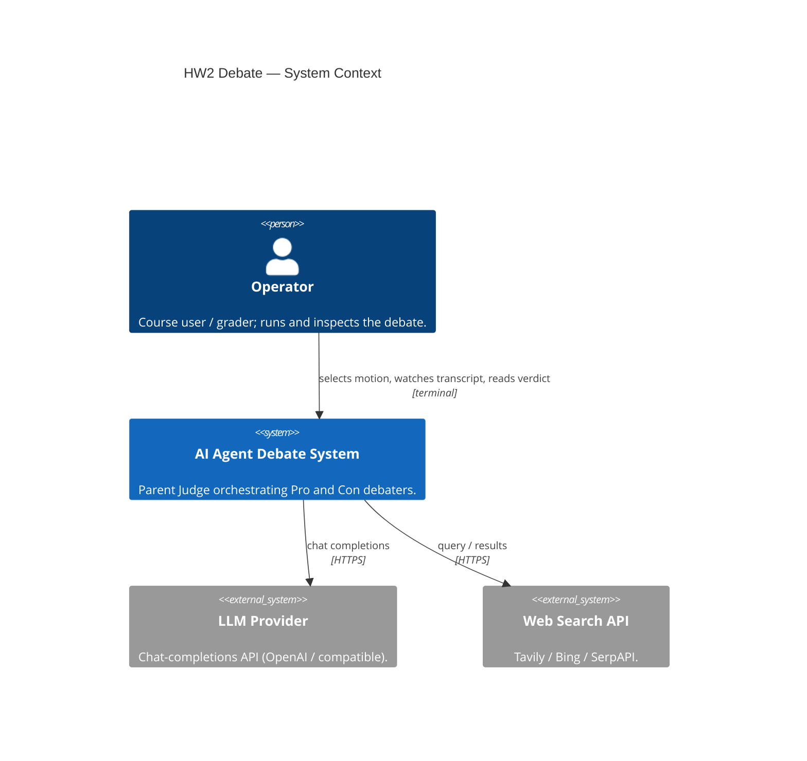
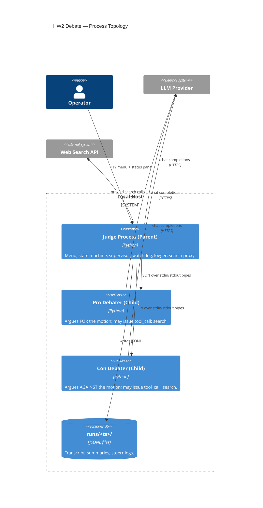
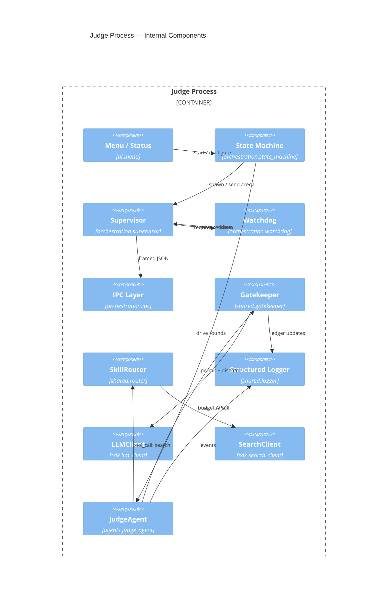
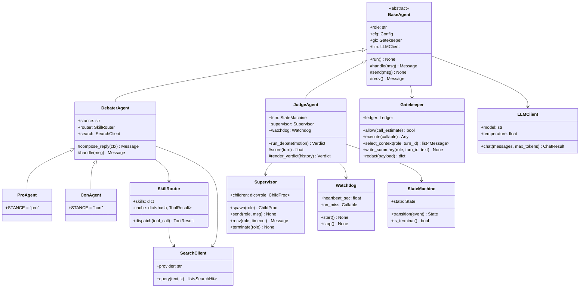
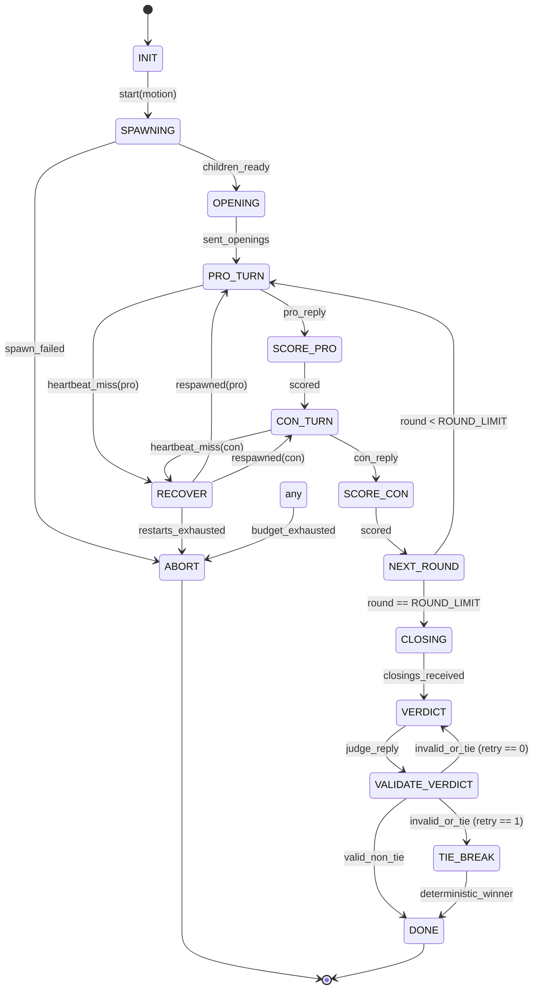

# Implementation Plan — HW2 AI Agent Debate

| Field    | Value               |
|----------|---------------------|
| Document | PLAN_HW2.md         |
| Version  | 1.00                |
| Status   | Draft — Bootstrap   |
| Updated  | 2026-05-17          |
| Pairs    | `docs/PRD_HW2.md`   |

---

## 1. Goals of this Plan

Translate `PRD_HW2.md` into an executable architecture: process topology, OOP
class hierarchy, debate state machine, JSON IPC schema, tooling, and a
phased delivery sequence. The plan deliberately fixes the **contracts**
(schemas, signatures, lifecycle) so subsequent prompts can implement modules
in isolation without breaking the system.

---

## 2. Repository Layout

```
HW2/
├── PROMPTS.md
├── README.md                    # generated last — lab report
├── pyproject.toml               # uv-managed, ruff + pytest config
├── uv.lock
├── .env-example
├── .gitignore
├── config/
│   ├── debate.json              # all runtime tunables
│   ├── motions.json             # curated motion library
│   └── prompts/
│       ├── judge.system.txt
│       ├── debater.system.txt
│       └── verdict.schema.json
├── docs/
│   ├── PRD_HW2.md
│   ├── PLAN_HW2.md              # this file
│   └── TODO_HW2.md              # generated from this plan
├── src/debate/
│   ├── __init__.py
│   ├── main.py                  # entry point + terminal menu
│   ├── sdk/
│   │   ├── __init__.py
│   │   ├── llm_client.py        # provider-agnostic chat wrapper
│   │   ├── search_client.py     # web-search wrapper
│   │   └── schemas.py           # pydantic models for all IPC messages
│   ├── agents/
│   │   ├── __init__.py
│   │   ├── base_agent.py        # IPC loop + Gatekeeper hooks
│   │   ├── debater_agent.py     # stance-driven, has search skill
│   │   ├── pro_agent.py         # stance = "pro"
│   │   ├── con_agent.py         # stance = "con"
│   │   └── judge_agent.py       # orchestrator + state machine
│   ├── orchestration/
│   │   ├── __init__.py
│   │   ├── supervisor.py        # spawns/monitors children
│   │   ├── watchdog.py          # heartbeat thread + respawn
│   │   ├── state_machine.py     # debate lifecycle FSM
│   │   └── ipc.py               # line-delimited JSON over pipes
│   ├── shared/
│   │   ├── __init__.py
│   │   ├── config.py            # JSON + .env loader, schema-validated
│   │   ├── gatekeeper.py        # budget/rate/keys + Select/Write helpers
│   │   ├── router.py            # SkillRouter + content-hash cache
│   │   ├── logger.py            # structured JSONL logger with redaction
│   │   └── secrets.py           # env-only key custody
│   └── ui/
│       ├── __init__.py
│       └── menu.py              # terminal menu + status panel
├── tests/
│   ├── unit/
│   │   ├── test_schemas.py
│   │   ├── test_gatekeeper.py
│   │   ├── test_router_cache.py
│   │   ├── test_state_machine.py
│   │   └── test_watchdog.py
│   └── integration/
│       ├── test_debate_smoke.py     # 2-round debate with stub LLM
│       ├── test_recovery_chaos.py   # kill -9 child mid-debate
│       └── test_budget_abort.py
└── runs/                            # gitignored; one dir per debate
```

---

## 3. C4 Architecture Diagrams

### 3.1 Level 1 — System Context



### 3.2 Level 2 — Containers (Processes)



### 3.3 Level 3 — Components inside the Judge



---

## 4. OOP Class Hierarchy

The hierarchy is designed so the **only stance-specific code** is a single
constant in `ProAgent` / `ConAgent`. All transport, budgeting, and tool
plumbing live in shared parents.



### 4.1 Class Responsibilities (textual)

- **`LLMClient`** (`sdk/llm_client.py`) — Provider-agnostic chat wrapper.
  Single public method `chat(messages, max_tokens) -> ChatResult`. Returns
  `(text, tokens_in, tokens_out, usd_cost)`. No retry / no budgeting — that
  is the Gatekeeper's job.
- **`SearchClient`** (`sdk/search_client.py`) — Same pattern for the web
  search provider. Returns a list of `SearchHit(title, url, snippet)`.
- **`Gatekeeper`** (`shared/gatekeeper.py`) — Single choke-point for *every*
  external call. Owns the `Ledger`, enforces caps (NFR-2), implements
  `select_context` / `write_summary` (NFR-4 Context Engineering), and
  redacts secrets before logging (NFR-11).
- **`SkillRouter`** (`shared/router.py`) — Dispatches named skills
  (`search`, `summarise`, `score`). The `search` skill is wrapped in a
  content-hash cache (NFR-5).
- **`BaseAgent`** (`agents/base_agent.py`) — Abstract; owns the IPC read /
  write loop, JSON framing, and Gatekeeper wiring. Subclasses implement
  `handle(msg)`.
- **`DebaterAgent`** (`agents/debater_agent.py`) — Adds stance prompt
  templating and the search tool. `ProAgent` / `ConAgent` are 5-line files
  that only set `STANCE`.
- **`JudgeAgent`** (`agents/judge_agent.py`) — Drives the `StateMachine`,
  scores each turn, enforces non-tie verdict, produces final JSON.
- **`Supervisor`** (`orchestration/supervisor.py`) — Owns the two
  `subprocess.Popen` children and the framed-JSON pipes.
- **`Watchdog`** (`orchestration/watchdog.py`) — Background thread sending
  pings, invoking `on_miss` callback (which calls `Supervisor.terminate` +
  `Supervisor.spawn`).
- **`StateMachine`** (`orchestration/state_machine.py`) — Pure, side-effect
  free; trivially unit-testable.

### 4.2 Anti-Duplication Rules

1. No agent class re-implements JSON read/write — only `BaseAgent.send/recv`.
2. No agent calls `LLMClient.chat` directly — always via `Gatekeeper.execute`.
3. No tool calls bypass `SkillRouter` — guarantees cache + audit trail.
4. Stance differences are a **single constant**, never branching logic.

---

## 5. Debate State Machine

The Judge owns a deterministic FSM. The Child agents never advance state on
their own — they react only to messages received from the Parent. The
**Child → Parent → Child** loop is enforced by the FSM: the Parent always
mediates, never letting two children speak in succession without scoring.



### 5.1 Round Accounting
- `ROUND_LIMIT = cfg.rounds` (default 10).
- One **round** = one Pro turn + one Con turn + two Judge scoring updates.
- Total LLM Judge calls per debate ≈ `2 * ROUND_LIMIT + 1` (per-turn scoring
  + final verdict). Per-turn scoring uses the `score` skill which can be
  routed to a cheaper model if `cfg.score_model` is set (Router-Skill).

### 5.2 Recovery Semantics
- `RECOVER` is entered only via the Watchdog callback. The FSM remembers the
  last outbound prompt for each role and replays it after respawn.
- `restarts_exhausted` (per child > `max_restarts_per_child`) transitions to
  `ABORT`. The transcript is still finalised and the verdict event records
  `outcome: "aborted"`.

---

## 6. Data Schema — JSON IPC Protocol

All messages are **single-line UTF-8 JSON**, `\n`-terminated. A `pydantic`
model lives in `src/debate/sdk/schemas.py`; both sides validate on
serialise and deserialise.

### 6.1 Common Envelope

```json
{
  "v": 1,
  "ts": "2026-05-17T12:34:56.789Z",
  "turn_id": 7,
  "role": "pro",
  "type": "reply",
  "payload": { "...": "..." }
}
```

| Field     | Type    | Notes                                                          |
|-----------|---------|----------------------------------------------------------------|
| `v`       | int     | Schema version; refuse mismatched.                             |
| `ts`      | string  | RFC-3339 UTC timestamp set by the **sender**.                  |
| `turn_id` | int     | Monotonic per debate; assigned by the Judge.                   |
| `role`    | enum    | `"judge"` \| `"pro"` \| `"con"`.                               |
| `type`    | enum    | See §6.2.                                                      |
| `payload` | object  | Type-specific; validated by sub-schema.                        |

### 6.2 Message Types

| `type`              | Direction          | `payload` shape                                                                                       |
|---------------------|--------------------|-------------------------------------------------------------------------------------------------------|
| `init`              | Judge → Child      | `{ "motion": str, "stance": "pro"\|"con", "rounds": int, "max_tokens_per_turn": int }`                |
| `prompt`            | Judge → Child      | `{ "phase": "opening"\|"argue"\|"closing", "context": [Message], "opponent_last": str \| null }`      |
| `reply`             | Child → Judge      | `{ "text": str, "tokens_in": int, "tokens_out": int }`                                                |
| `tool_call`         | Child → Judge      | `{ "skill": "search", "args": { "query": str, "k": int } }`                                           |
| `tool_result`       | Judge → Child      | `{ "skill": "search", "hits": [{ "title": str, "url": str, "snippet": str }], "cached": bool }`       |
| `ping`              | Judge → Child      | `{}`                                                                                                  |
| `pong`              | Child → Judge      | `{ "turn_id": int }`                                                                                  |
| `score`             | Judge (internal)   | `{ "for_role": "pro"\|"con", "round": int, "points": [str], "score": float }`                        |
| `verdict`           | Judge → run.jsonl  | `{ "winner": "pro"\|"con", "reasons": [str], "scores": { "pro": float, "con": float } }`              |
| `event`             | any → run.jsonl    | `{ "name": str, "data": object }` (e.g., `budget_exhausted`, `child_unrecoverable`, `child_respawn`)  |
| `shutdown`          | Judge → Child      | `{ "reason": str }`                                                                                   |

### 6.3 Verdict Schema (strict)

`config/prompts/verdict.schema.json` — used to validate the Judge's reply:

```json
{
  "$schema": "http://json-schema.org/draft-07/schema#",
  "type": "object",
  "required": ["winner", "reasons", "scores"],
  "properties": {
    "winner": { "enum": ["pro", "con"] },
    "reasons": {
      "type": "array",
      "minItems": 3,
      "items": { "type": "string", "minLength": 20 }
    },
    "scores": {
      "type": "object",
      "required": ["pro", "con"],
      "properties": {
        "pro": { "type": "number", "minimum": 0, "maximum": 100 },
        "con": { "type": "number", "minimum": 0, "maximum": 100 }
      }
    }
  },
  "additionalProperties": false
}
```

Note: `"tie"` is **not** in the `winner` enum — invalid by construction.

### 6.4 Tie-Breaker Rule (deterministic)
If two consecutive verdict attempts fail validation, the winner is computed
as `argmax(sum(score.points) per role)` across all `score` events in
`run.jsonl`. Ties at the cumulative-score level are broken by the role that
spoke last (`con`) — documented and reproducible.

---

## 7. Tooling & Environment

### 7.1 `uv` — Environment & Dependencies
- `uv init` to scaffold `pyproject.toml`.
- `uv add pydantic httpx python-dotenv jsonschema rich` (runtime).
- `uv add --dev ruff pytest pytest-asyncio pytest-cov` (dev).
- `uv sync` for reproducible installs from `uv.lock`.
- `uv run python -m debate.main` is the canonical entry point.

### 7.2 `ruff` — Lint & Format
- Config in `pyproject.toml` under `[tool.ruff]`.
- Rule sets: `E`, `F`, `I` (isort), `UP`, `B`, `SIM`, `RUF`.
- Line length 100, double quotes, format on save.
- `uv run ruff check && uv run ruff format --check`.

### 7.3 `pytest` — Tests
- `tests/unit/` — pure functions, schemas, FSM, cache, Gatekeeper math.
- `tests/integration/` — stub LLM (deterministic echo) + real subprocess
  IPC, including chaos and budget-abort scenarios.
- Coverage gate ≥ 80 % on `src/debate/shared` and `src/debate/orchestration`
  (the deterministic core).

### 7.4 Configuration & Secrets
- `shared/config.py` loads `config/debate.json` and overlays `.env` via
  `python-dotenv`; validates with `pydantic.BaseModel`.
- `shared/secrets.py` exposes `get_key(name)` — the only API-key accessor;
  raises if unset.

---

## 8. Delivery Phases (suggested ordering)

| Phase | Deliverable                                      | Exit Criterion                                                |
|-------|--------------------------------------------------|---------------------------------------------------------------|
| P0    | Repo scaffold, `pyproject.toml`, `.env-example`, `config/*`. | `uv sync` clean; `ruff check` green.                  |
| P1    | `sdk/schemas.py` + unit tests.                   | Round-trip JSON validates; bad shapes rejected.               |
| P2    | `shared/config.py`, `secrets.py`, `logger.py`.   | Config loads; missing keys raise; logger redacts.             |
| P3    | `shared/gatekeeper.py`, `shared/router.py`.      | Budget caps enforced; search cache hits on repeat query.      |
| P4    | `sdk/llm_client.py`, `sdk/search_client.py`.     | Wired through Gatekeeper; integration test with stubs.        |
| P5    | `orchestration/ipc.py`, `state_machine.py`, `supervisor.py`, `watchdog.py`. | FSM unit-tested; Supervisor smoke test with echo child. |
| P6    | `agents/base_agent.py`, `debater_agent.py`, `pro_agent.py`, `con_agent.py`. | Two children debate via stubbed Judge driver.           |
| P7    | `agents/judge_agent.py`, scoring + verdict prompts. | End-to-end debate produces non-tie verdict.                |
| P8    | `ui/menu.py`, `main.py`, status panel.           | Menu launches debate; status panel updates per turn.          |
| P9    | Chaos + budget integration tests, README report. | All SC-1..SC-7 from PRD pass.                                 |

---

## 9. Open Questions (resolve before P7)

1. Which LLM provider is canonical for grading? (default: `gpt-4o-mini`.)
2. Which search provider has the most reliable free tier for the course?
3. Should the Judge use a *different* (stronger) model than the debaters?
   — supported via `cfg.judge_model`, default = `cfg.model`.
4. Should transcripts be uploaded to the course portal or kept local? — v1
   keeps local; portal upload is a follow-up.

